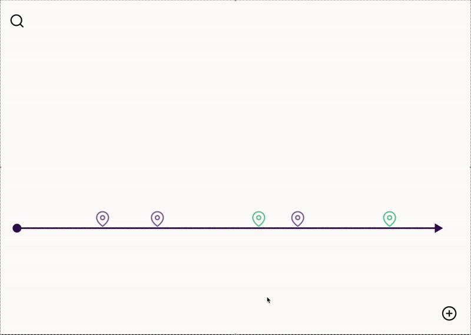

# Project Proposal-(Project Title)

## Project Overview:

The goal of this project is to develop a web application that enables users to explore historical and academic events dynamically through an interactive timeline. Users can search for any topic of their interest such as “mathematics” or “computer science,” and generate their own customized timeline to showcase the major events of the field. From there, users can additionally refine their query by searching and filtering accordingly. Additionally, the platform allows users to create and personalize their own timelines based on their topics of interest or their personal lives. 

This tool serves as a research or educational aid and can provide knowledge about how specific fields have evolved over time and even how different topics intersect. The system will aggregate various data sources for a well-rounded timeline.

## Description:

This application provides users with a powerful tool to explore and visualize historical and academic events based on specific topics. The core problem it addresses is the lack of a dynamic platform for viewing topic-based event timelines.

By allowing users to create their own customized timelines and refine searches, this application serves students, researchers, and history enthusiasts who seek to understand the relation of various fields. The ability to add personal events also makes it a tool for tracking personal milestones and exploring friends' life stories.

### Key Features ###

1. View Events: Users can explore categorized events (e.g., historical, academic, personal) and toggle them on/off. They can filter events based on timeframes and expand event details.

2. Search & Filter: Users can search for events using keywords and refine timelines by event categories or timeframes.

3. Create Personal Events: Logged-in users can add, edit, and delete personal events with descriptions and images.

4. Shared Timelines: Users can create and share timelines with friends, combining life events into a single view.

5. Snapshot & Export: Users can capture and share timeline screenshots.
   
## Creative Components:

Users can create personal events on the timeline, connect with friends, and view their combined life events on a single timeline. This allows users to track shared experiences over time. Each user can choose to make their timeline private, shared with friends, or public. 

Users will also have the option to share their timeline externally to social media, filtering the categories, time period of the timeline that they desired.

## Usefulness:

This application will serve users such as researchers, students, and history enthusiasts by offering an intuitive way to explore the evolution of topics overtime. Unlike static historical databases, our application is more dynamic as users can generate topic based timelines on demand. Similar tools may exist, but this offers an aggregation of various sources and is customizable to refine searches to fit the exact user need.  

Additionally, users can add their events, whether it is a topic related to their research or their personal endeavors. For example, users can include personal events alongside historical ones or students and professionals could use this feature to track and organize their projects, research, and deadlines. Users can also connect with friends on *insert app name* and view everyone's life at a glance.
## Data Sources:

We currently categorized our events into two types, general historical events and scientific research events. These APIs will be used to get the authors, title, DOI, and date of publication of research articles.

### For research paper events: ###
1. Semantic Scholar Datasets API and/or
2. PubMed API: Entrez Programming Utilities (E-utilities). 
### For (general) historical events: ###
1. GDELT
2. BDpedia.

## Functionality Description:

1. Create: Users can create a new account.
2. Create: Users can add new personal events, which include a name, date, description, categories, and image.
3. Read: Users can view and search events based on category or time period.
4. Update: Users can edit or update event details.
5. Delete: Users can remove personal events.
6. Search: Users can filter timelines more advancedly by keyword, category, and time range.

## UI mockup:

The UI mockup showcased the main timeline, with two different categories of events. And the interaction for filtering categories, searching by keywords, searching and adding friends, and adding new events.

## Project work distribution:
### **Website (Front-end)**
- **Rendering a dynamic timeline visualization**
- **Emerald (Nai-Syuan):** General UI Layout of home page
- **Search and filter functionalities**
  - Time range selection, filtering by category, key-word based searching
- **Login page**

### **Database (Back-end)**
- **Retrieve data from external sources**
  - **Taisia**: Retrieve data for scholarly article timeline events.
  - **Beau**: Retrieve data for historical events.
- **Designing database tables and relationships**
- **Sort/process data**
- **CRUD operations**
- **Making the timelines**
- **Integrating user authentication**
### **Emerald (Nai-Syuan):** ###Connect the front-end and back-end
### **Testing**

